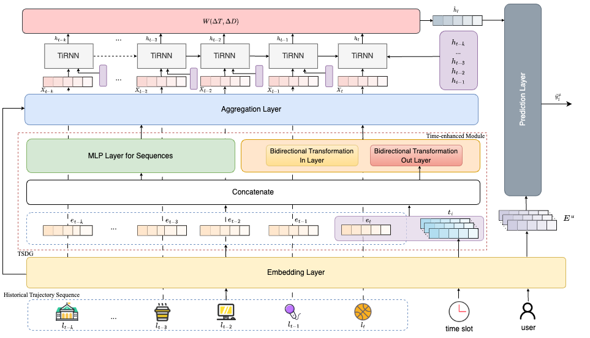

# Next POI Recommendation Based on Time Slot Preferences and Bidirectional Transformation Modeling


# 安装依赖包

```
pip install -r requirements.txt
```

# 数据预处理

1. 从[flashback_data.zip](https://drive.google.com/file/d/1QXdpp0_QesJo7NZdhvoafg4MlpI_Bx-O/view?usp=sharing)下载数据集，并放置data文件夹下：

TSPM/data/checkins-gowalla.txt

TSPM/data/checkins-4sq.txt

2. 运行RotatE_prepare/utils.py文件。

在该文件最后可以设置filepath：“../data/checkins-gowalla.txt”，可以设置为Gowalla数据集或Foursquare数据集，我们以Gowalla为例。

这个文件（RotatE_prepare/utils.py）其实是把checkins-gowalla.txt文件中的用户、POI进行了一个过滤，剔除了访问POI小于101次的不活跃用户，并把用户id、POIid重新进行了一个映射，可以看出checkins-gowalla.txt中共有7768个活跃用户、106994个对应POI。

- 生成一个**Pdata_gowalla.npy文件**，该文件包含7768个条目，每个条目对应【(1)用户id，(2)用户访问的POI对应的**时间戳列表**（顺序排序），(3)用户访问POI对应的**时间周期列表**（一周的第几个小时），(4)用户访问的POI对应的**经纬度列表**，(5)用户访问的**POI对应的id列表**】
- 生成了一个**Count_gowalla.npy文件**，这个文件仅记录一下过滤后的用户、POI数量，即（7768，106994）。

3. 运行RotatE/utils.py文件。

- 生成**entity_list_gowalla.npy文件**，该文件包含106994个POI id数据。

- 生成**relation_dict_gowalla.npy文件**，该文件包含关系字典。
- 生成**relation_only_pre_and_sub_gowalla.npy文件**，该文件包含连续访问记录。

4. 运行RotatE/Graph_Trainer.py文件。

代码运行过程会生成临时文件，暂时不用管：count_dict_gowalla.npy，包含每个头结点出现的**频率**。true_tail_dict_gowalla.npy，包含每个头节点所连接的**尾节点列表**。

- 生成**kge_model-gowalla.npy文件**，应该包含每个POI的embedding（106994\*400）以及关系embedding（1\*200）。

- 生成**coo_gowalla_neighbors.npz文件**，应该以稀疏矩阵的形式保存了生成的**静态POI转化图**（106994,106994）。

5. 运行RotatE/spectral_clustering.py文件。

这段代码的主要目的是使用**拉普拉斯特征映射**（Laplacian Eigenmaps）进行**降维**，并基于降维后的特征进行**聚类**。对应文中Enginmap方法。

- 生成**I_gowalla.npy文件**，包含106994个POI通过kmeans聚类所对应的域（共200个域）。
- 生成**list_centroids_gowalla.npy文件**，包含200个域所对应的POI，存储的不是序号，是数组（3维），200个二维数组表示200个域所有的POI，每个二维数组包含该域内每个POI的20维embedding表示。
- 生成**vecs_use_gowalla.npy文件**，包含106994个POI对应的20维embedding表示。【**经过Eigenmap方法后的POI embedding**，这个文件的生成方法需要用到】
- 生成**list_number_gowalla.npy文件**，包含一个200维的数组，其中每一项都是一个数组，包含该域中所有POI的编号。【可以直接用这个文件与RotatE/utils.py中的**self.user2id**的反转字典进行对应，得到每个域中所有POI对应原始文件的id，再得到其经纬度坐标】

# 模型训练

1. 运行train_copy_combined.py文件，与该文件对应的模型文件为network_coalition.py。

该文件如下使用联合训练方式：

$\mathcal{L} = -\sum_t\psi(||(\xi_{i,T_{z}}^{out}+\xi_t)/2-\xi_{-,T_{z}}^{in}||_2^2-||(\xi_{i,T_{z}}^{out}+\xi_t)/2-\xi_{+,T_{z}}^{in}||_2^2)$

$s_{i,j}^{d}=e^{-\rho_1||\xi_{i}-{\mathbf{e}}_{j}||_{2}^{2}-\rho_2||\xi_{i,T_z}^{out}-\xi_{j,T_z}^{in}||_{2}^{2}}$

- 生成**dyn_network_combined_gowalla_60.pth文件**，其保存了预训练模型。

2. 运行train.py文件。

该文件每次运行，得到对应时间段的结果，目前分为3个时间段，需要运行三次该文件。

每次运行前需要修改network_coalition.py文件下emb_with_neighbor_output()函数中的target_time_segment，将其设为(0/1/2)，同样的需要修改evaluation.py文件中的target_time_segment，设为对应值。

模型一般会在35epoch达到最好效果。

# Acknowledgements

- [Flashback](https://github.com/eXascaleInfolab/Flashback_code) The model architecture of Graph-Flashback follows Flashback.


